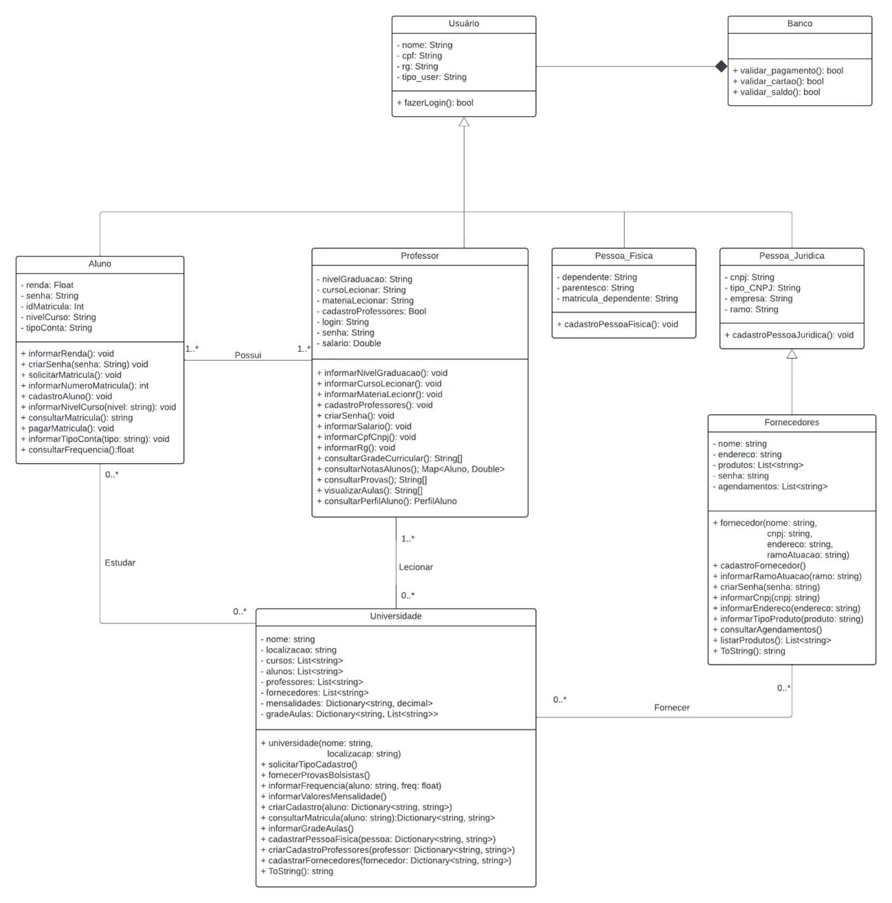

# Universidade:

### Cadastro de Aluno:
- **Login e segurança**:
  - Fazer login
  - Criar senha
- **Dados pessoais e acadêmicos**:
  - Informar renda
  - Informar número da matrícula
  - Informar nível de curso desejado
  - Informar tipo de conta
- **Processos acadêmicos**:
  - Solicitar matrícula
  - Pagar matrícula
  - Consultar frequência

### Cadastro de Pessoa Física:
- **Login e Segurança**:
  - Fazer login
  - Criar senha
- **Dados Pessoais**:
  - Informar CPF
  - Informar RG
- **Relacionamentos e dependências:**
  - Informar se é responsável por algum aluno
  - Informar dependente
  -Associar a matrícula de um aluno

### Cadastro de Pessoa Jurídica:
- **Dados básicos**:
  - Informar CNPJ
  - Informar número de matrícula (se aplicável)
- **Informações adicionais**:
  - Informar tipo de empresa
  - Informar área de atuação
  - Informar tipo de CNPJ

### Cadastro de Professor:
- **Login e segurança**:
  - Fazer login
  - Criar senha
- **Dados pessoais e profissionais**:
  - Informar CPF/CNPJ
  - Informar RG
  - Informar nível de graduação
  - Informar curso a lecionar
  - Informar matéria a lecionar
  - Informar salário
- **Funções acadêmicas**:
  - Consultar grade curricular
  - Consultar notas dos alunos
  - Consultar provas
  - Visualizar aulas
  - Consultar perfil do aluno

### Cadastro de Fornecedor:
- **Cadastro e segurança**:
  - Criar cadastro
  - Criar senha
  - Fazer login
- **Dados empresariais**:
  - Informar CNPJ
  - Informar endereço
  - Informar ramo de atuação
  - Informar tipo de produto
- **Gestão de agenda**:
  - Consultar agendamentos

# Caso de uso

# Diagrama de classe

